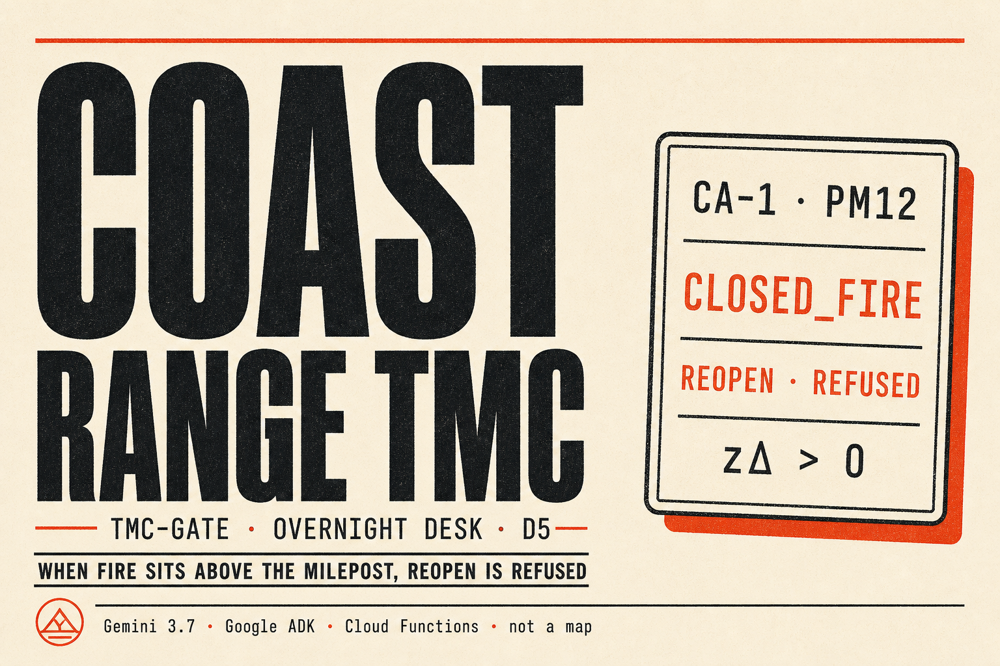
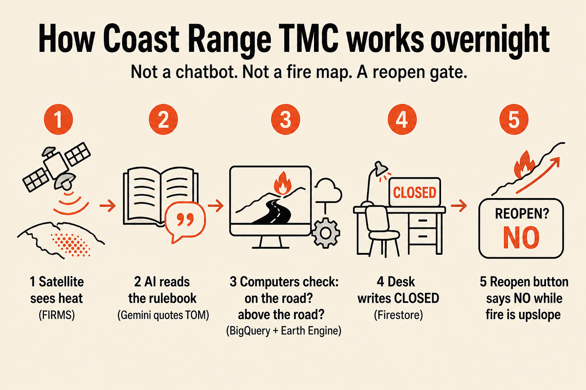
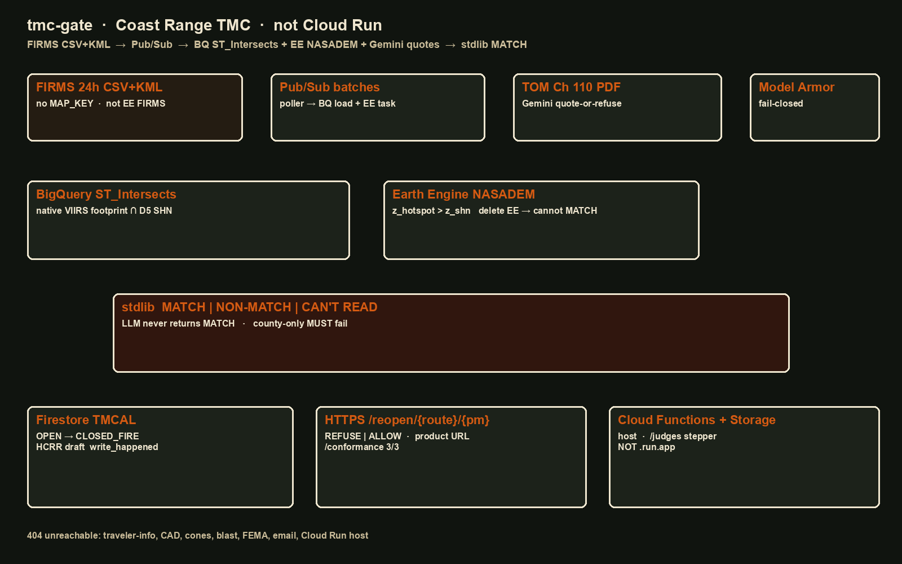

# Coast Range TMC · tmc-gate

<p align="center">
  
</p>

**When a satellite fire footprint sits upslope of this postmile, write the overnight closure and refuse Reopen — before first shift.**

| | |
|---|---|
| **Product** | `tmc-gate` |
| **Demo identity** | **Coast Range TMC** (fixture TMC · D5-shaped highway clip) |
| **Track** | [All Things Agentic](https://allthingsagentichackathon.devpost.com/) · **The Taskmaster** |
| **Live URL** | https://us-central1-all-things-agents-507211.cloudfunctions.net/tmc-gate |
| **Host** | **Cloud Functions** (`cloudfunctions.net`) — **not** Cloud Run / `.run.app` |
| **What it is not** | Not Caltrans. Not a fire map. **Not a chatbot.** |

Start here as a judge: open [`/judges`](https://us-central1-all-things-agents-507211.cloudfunctions.net/tmc-gate/judges) → click **→ POST /reopen/CA-1/PM12** → see **REFUSED** with three quotes.

---

## The problem (plain language)

Imagine a coastal highway at night. Somewhere above the road, a wildfire is burning on the slope. Rocks and debris can fall onto the traveled way. A Traffic Management Center (TMC) is supposed to keep the **board** honest: which postmiles are open, which are closed for fire, and whether anyone may **reopen** a closed stretch.

During the day, people can radio, drive, and look. **Overnight the desk is dark** (this fixture: roughly 18:00–06:00 America/Los_Angeles on weekdays). Satellites still see heat. NASA’s FIRMS feed publishes fresh detections every few hours. The rulebook already says hard things in English:

- Report **county, route, and post mile**
- File a Highway Condition Report within **10 minutes** of a full/directional closure
- Treat **steep slope above the highway** as the danger — not “there is fire somewhere in the county”

What a human cannot do, postmile by postmile, while asleep, is ask:

> Is this satellite footprint still sitting **above this exact stretch of road** — and if so, may anyone reopen it?

**Closing “Monterey County” because there is a fire** is the wrong product. Inland pixels are not the traveled way. A pretty fire map is also the wrong product: if you strip the map and nothing remains, you built a costume.

**Coast Range TMC** does the leftover job: keep a system-of-record row (`OPEN → CLOSED_FIRE`) and a real **reopen gate** that answers **REFUSED** while the footprint is still upslope — with the evidence attached.

<p align="center">
  
</p>

| Step | What happens | Who does it |
|---|---|---|
| 1 | Satellite heat arrives (FIRMS 24h CSV) | NOAA / NASA public feed |
| 2 | AI **reads the rulebook** and quotes it (never decides MATCH) | **Gemini 3.7** via **Google ADK** |
| 3 | Computers check: on the highway? **above** the highway? | **BigQuery** + **Earth Engine** |
| 4 | Desk writes **CLOSED_FIRE** + HCRR draft | **Firestore** |
| 5 | Someone tries reopen → **REFUSED** while still upslope | Product URL `/reopen/{route}/{pm}` |

---

## What you are looking at (30-second judge path)

1. **[`/judges`](https://us-central1-all-things-agents-507211.cloudfunctions.net/tmc-gate/judges)** — Frozen A shows **MATCH**, quote card, conjunction chips, write log (server-rendered on first paint).
2. **[`/reopen/CA-1/PM12`](https://us-central1-all-things-agents-507211.cloudfunctions.net/tmc-gate/reopen/CA-1/PM12)** — **REFUSED** + FIRMS / SHN / elevation quotes. This is a **product URL**, not a toy button.
3. **[`/reopen/CA-1/PM47`](https://us-central1-all-things-agents-507211.cloudfunctions.net/tmc-gate/reopen/CA-1/PM47)** — **ALLOWED** after Frozen A. Proves we are not a county webhook.
4. **[`/health?format=json`](https://us-central1-all-things-agents-507211.cloudfunctions.net/tmc-gate/health?format=json)** — eight enablement letters + `eligibility.gemini_routing` (3.7 / 3.5 / 3.1-Lite).
5. **[`/conformance`](https://us-central1-all-things-agents-507211.cloudfunctions.net/tmc-gate/conformance)** — **3/3** against **Firestore** objects (not against Gemini prose).

Film shot list: [`scripts/demo_shotlist.md`](scripts/demo_shotlist.md).

---

## How we used Google’s stack (eligibility + depth)

Contest floor: **Gemini 3.5+**, **one Google Agent Framework**, **one Google Cloud infrastructure service**. We use the floor and then go deep on purpose.

### Mandatory triad

| Requirement | What Coast Range TMC uses | Where to verify |
|---|---|---|
| **Gemini 3.5 or newer** | **`gemini-3.7-flash`** primary on **Vertex AI** (`GOOGLE_CLOUD_LOCATION=global`) | `/health` → `eligibility.gemini` |
| **Google Agent Framework** | **Google ADK** — `LlmAgent` + `AgentTool` + `FunctionTool` | `/health` → `eligibility.agent_framework` |
| **Google Cloud infrastructure** | **Cloud Functions** host + **Firestore**, **Pub/Sub**, **BigQuery**, **Earth Engine**, **Model Armor**, **Secret Manager**, **Cloud Storage**, **Cloud Scheduler**, **Vertex AI** | `/health` → `letters` A1–A8 + `eligibility.cloud_infrastructure` |

### Additional Gemini models (task-routed)

| Task | Model | Role |
|---|---|---|
| Overnight parent | **`gemini-3.7-flash`** | Multi-step FunctionTool orchestration |
| Overnight shed | **`gemini-3.5-flash`** | Same tools if Vertex returns 429 |
| Quote clerk | **`gemini-3.7-flash`** | Verbatim TOM / PIO / FIRMS quotes |
| Quote shed | **`gemini-3.5-flash`** | Stay ≥ 3.5 floor if primary fails |
| Lite probe | **`gemini-3.1-flash-lite`** | Cheap non-decision traffic only |
| **MATCH / NON-MATCH** | **stdlib** (BigQuery + Earth Engine + Python) | **LLM never decides MATCH** |

Routing lives in `src/tmc_gate/model_router.py` and is printed on `/health` → `eligibility.gemini_routing`.

### Why each Google service is load-bearing

| Service | Job in this product | Fail-closed behavior |
|---|---|---|
| **Vertex AI · Gemini** | Quote TOM Ch 110 + FIRMS attributes; ADK tool loop | Never invent MATCH from model text |
| **Google ADK** | Overnight agent is a workflow, not a chat box | Tools are real side effects |
| **Cloud Functions (2nd gen)** | Public HTTPS product host | Advertise `cloudfunctions.net` only |
| **Firestore** | TMCAL system of record + HCRR + reopen log | `/conformance` scores these objects |
| **BigQuery** | `ST_Intersects` native VIIRS pixel ∩ D5 SHN | Delete BQ → cannot MATCH |
| **Earth Engine** | NASADEM `z_hotspot > z_shn` (upslope) | Delete EE → cannot MATCH |
| **Pub/Sub** | Wake witness topics (`firms-batches`, `firms-ee-tasks`) | Overnight publish trail |
| **Model Armor** | Fail-closed prompt screening (regional `us-central1`) | Print failed letter — do not skip |
| **Secret Manager** | Keys / AIML fallback secret — not in git | ADC preferred on Functions |
| **Cloud Scheduler** | Unattended `GET /wake?case=live` | Background Taskmaster chore |
| **Cloud Storage** | Deploy source / artifacts | Supporting infra |

**We do not use Veo, Lyria, or Gemma.** We do not advertise **Cloud Run**.

### A10 claim (print this)

```
A10 claim: ENABLED
Gemini:       gemini-3.7-flash primary (Vertex AI, location=global; sheds=3.5; lite=3.1-flash-lite)
ADK:          LlmAgent + AgentTool + FunctionTools
Earth Engine: enabled (NASADEM upslope)
BigQuery:     enabled (ST_Intersects)
Pub/Sub:      enabled
Model Armor:  enabled (fail-closed)
Firestore:   enabled (TMCAL SoR)
Cloud Functions / Secret Manager / Cloud Storage / Scheduler: enabled
Host:         cloudfunctions.net  (NOT .run.app)
```

---

## Technical architecture

<p align="center">
  
</p>

**One sentence:** FIRMS and Scheduler hit **Cloud Functions**; **Gemini + ADK** quote the rulebook; **BigQuery ∩ Earth Engine** decide geometry; **Python stdlib** conjuncts; **Firestore** mutates; the desk UI and `/reopen` show the gate.

```
FIRMS CSV/KML ──┐
Scheduler ──────┼──► Cloud Functions (tmc-gate)
TOM / PIO ──────┘         │
                          ├─ Model Armor (fail-closed)
                          ├─ Google ADK + Gemini 3.7 (quotes only)
                          │       └─ FunctionTools: fetch → quote → join → write → publish → reopen
                          ├─ BigQuery ST_Intersects (on road?)
                          ├─ Earth Engine NASADEM (above road?)
                          ├─ stdlib gate → MATCH | NON-MATCH | CAN'T READ
                          └─ Firestore TMCAL ──► /reopen REFUSED|ALLOWED
                                               /conformance 3/3
                                               /judges desk (SSR first paint)
```

### The decision rule (stdlib, not the model)

\[
\text{MATCH} = C_{\{\text{nominal},\text{high}\}} \;\land\; \operatorname{ST\_Intersects}(F,S) \;\land\; (z_{\text{hotspot}} > z_{\text{SHN}}) \;\land\; R \in D5
\]

- Native geometry = VIIRS pixel from CSV `scan` × `track` (~375 m) — **no invented 100-ft buffer**
- Live gun = FIRMS **24h CSV+KML** (no `MAP_KEY`) — **not** the Earth Engine FIRMS catalog
- County-only closer **must fail** (`test_county_only_must_fail`)

### Frontend doctrine

Dark dispatcher desk (`#0b0b0c`), typography-as-state, quote card, conjunction strip, write log, **zero chat**. `/judges` **server-renders** Frozen A / 404 / conformance on first paint so a curl still shows proof; JS refreshes Live FIRMS on every Live tab open.

---

## Product surfaces

| Path | What a judge should see |
|---|---|
| [`/judges`](https://us-central1-all-things-agents-507211.cloudfunctions.net/tmc-gate/judges) | Frozen A / B · Live · 404 · conformance |
| [`/health`](https://us-central1-all-things-agents-507211.cloudfunctions.net/tmc-gate/health?format=json) | A1–A8 letters + Gemini routing |
| [`/wake?case=frozen_a`](https://us-central1-all-things-agents-507211.cloudfunctions.net/tmc-gate/wake?case=frozen_a) | Currently-on-fire MATCH (reproducible) |
| [`/wake?case=frozen_b`](https://us-central1-all-things-agents-507211.cloudfunctions.net/tmc-gate/wake?case=frozen_b) | Inland NON-MATCH (not a county webhook) |
| [`/wake?case=live`](https://us-central1-all-things-agents-507211.cloudfunctions.net/tmc-gate/wake?case=live) | This morning’s FIRMS GET |
| [`/reopen/CA-1/PM12`](https://us-central1-all-things-agents-507211.cloudfunctions.net/tmc-gate/reopen/CA-1/PM12) | **REFUSED** while Frozen A span is closed |
| [`/reopen/CA-1/PM47`](https://us-central1-all-things-agents-507211.cloudfunctions.net/tmc-gate/reopen/CA-1/PM47) | **ALLOWED** after Frozen A |
| [`/reopen/CA-1/PM12?format=cert`](https://us-central1-all-things-agents-507211.cloudfunctions.net/tmc-gate/reopen/CA-1/PM12?format=cert) | Refusal certificate (hashes + quotes) |
| [`/conformance`](https://us-central1-all-things-agents-507211.cloudfunctions.net/tmc-gate/conformance?format=json) | **3/3** vs Firestore |
| [`/llms.txt`](https://us-central1-all-things-agents-507211.cloudfunctions.net/tmc-gate/llms.txt) | Machine-readable endpoint map |

Honest film numbers for this fixture: Frozen A closes **CA-1 bPM 0–25.806** (mid-span ~PM 12.903). Film **PM12** for REFUSED; **PM47** for ALLOWED.

---

## Kill-if (we kill ourselves)

Full list: [`docs/kill-if.md`](docs/kill-if.md) · judging notes: [`docs/honest-judging.md`](docs/honest-judging.md)

- County webhook (`Monterey → close Hwy 1`) or a pre-parsed postmile `set`
- The artifact is a fire map; strip the map and nothing remains
- `/reopen` lives only on `/judges`
- **Cloud Run / `.run.app` as the advertised host**
- Email · traveler-info publish · CAD write
- Invented 100-ft / 30-m buffer
- EE FIRMS catalog as the live gun
- MATCH from LLM output / `eval` of Gemini text
- Silently skip Earth Engine or Model Armor
- Gemini older than 3.5 on the production overnight / quote path
- Join still MATCHes after deleting BQ or EE

---

## Local spin-up (no GCP keys)

Python 3.11+:

```powershell
python -m venv .venv
.\.venv\Scripts\Activate.ps1
pip install -e ".[dev]"
pytest
$env:FUNCTION_TARGET = "tmc_gate"
$env:TMC_STORE = "memory"
$env:TMC_ADK_ORCHESTRATE = "0"
functions-framework --target=tmc_gate --source=main.py --debug --port=8080
```

Then open http://127.0.0.1:8080/judges and `POST /wake?case=frozen_a` → `POST /reopen/CA-1/PM12`.

---

## GCP spin-up

See [`scripts/hour0_enable.ps1`](scripts/hour0_enable.ps1) — **Earth Engine first**. Register the project for EE. Gemini 3.7/3.5 on Vertex need `GOOGLE_CLOUD_LOCATION=global`. Model Armor stays `us-central1`. Prefer ADC on Cloud Functions; optional secrets in Secret Manager. **Do not** commit `.env` keys. **Do not** mint user-managed SA JSON keys into git.

Deployable: 2nd gen HTTP Cloud Function `tmc-gate`, entry `tmc_gate`. Advertise only:

`https://us-central1-all-things-agents-507211.cloudfunctions.net/tmc-gate`

Overnight Scheduler example:

```powershell
gcloud scheduler jobs create http tmc-gate-overnight-live `
  --location=us-central1 `
  --schedule="15 * * * *" `
  --time-zone="America/Los_Angeles" `
  --uri="https://us-central1-all-things-agents-507211.cloudfunctions.net/tmc-gate/wake?case=live&source=scheduler" `
  --http-method=GET `
  --attempt-deadline=540s
```

---

## Reproducible testing

Named tests in `tests/test_join_gate.py` and `tests/test_api.py`. We do **not** claim hundreds of tests — we claim the load-bearing ones.

```powershell
python -m venv .venv
.\.venv\Scripts\Activate.ps1
pip install -e ".[dev]"

$env:TMC_STORE = "memory"
$env:TMC_FIRESTORE = ""
$env:TMC_EARTH_ENGINE = ""
$env:TMC_ADK_ORCHESTRATE = "0"
$env:GOOGLE_API_KEY = ""
$env:GEMINI_API_KEY = ""

python -m pytest tests/ -v
```

Expected: **all pass** (22+). Grep these names:

| Test | Why it exists |
|---|---|
| `test_county_only_must_fail` | U7 kill — not a Monterey webhook |
| `test_delete_ee_cannot_match` | NASADEM missing → no MATCH |
| `test_delete_bq_cannot_match` | Intersect missing → no MATCH |
| `test_no_invented_100ft_buffer` | Native VIIRS pixel only |
| `test_reopen_refused_includes_quotes` | Product URL + three quotes |
| `test_reopen_pm47_not_county_webhook` | PM47 ALLOWED after Frozen A |
| `test_conformance_3_of_3` | Scores SoR objects |
| `test_unreachable_404` | traveler-info / CAD / email 404 |
| `test_no_cloud_run` | Host is Functions |
| `test_board_dedupes_same_span` | One row per SHN span |
| `test_refusal_certificate` | `?format=cert` |
| `test_desk_html_surfaces` | SSR first paint |

Hosted smoke:

```powershell
$B = "https://us-central1-all-things-agents-507211.cloudfunctions.net/tmc-gate"
curl.exe -sS "$B/health?format=json"
curl.exe -sS "$B/wake?case=frozen_a"
curl.exe -sS -X POST "$B/reopen/CA-1/PM12" -H "Accept: application/json" -d "{}"
curl.exe -sS "$B/conformance?format=json"
```

---

## Data sources

- **NOAA FIRMS** 24h VIIRS CSV/KML (public, no MAP_KEY) — live gun
- **D5-shaped SHN clip** (fixture GeoJSON; 32 Monterey CA-1 segments in `fixtures/shn/mon_ca1.geojson`)
- **TOM Chapter 110** packet + PIO upslope language (quoted, not invented MATCH)
- **NASADEM** via Earth Engine (`NASA/NASADEM_HGT/001`)

---

## Docs in this repo

| Doc | Purpose |
|---|---|
| [`architecture.png`](architecture.png) | Devpost architecture upload |
| [`docs/assets/readme-hero.png`](docs/assets/readme-hero.png) | Project face / thumbnail |
| [`docs/assets/readme-how-it-works.png`](docs/assets/readme-how-it-works.png) | Non-tech explainer |
| [`docs/kill-if.md`](docs/kill-if.md) | Tripwires |
| [`docs/honest-judging.md`](docs/honest-judging.md) | Rubric honesty |
| [`docs/devpost-story.md`](docs/devpost-story.md) | Long-form story paste |
| [`scripts/demo_shotlist.md`](scripts/demo_shotlist.md) | ~4 min film order |
| [`llms.txt`](llms.txt) | Endpoint map for AI judges |
| [`SECURITY.md`](SECURITY.md) | Security contact / secrets policy |

---

## License

MIT. See [`LICENSE`](LICENSE).

**Coast Range TMC** is a fixture identity for this hackathon demo. It is not Caltrans, not an official TMC, and not a substitute for field assessment. `/facility-reopen` is intentionally unreachable.
